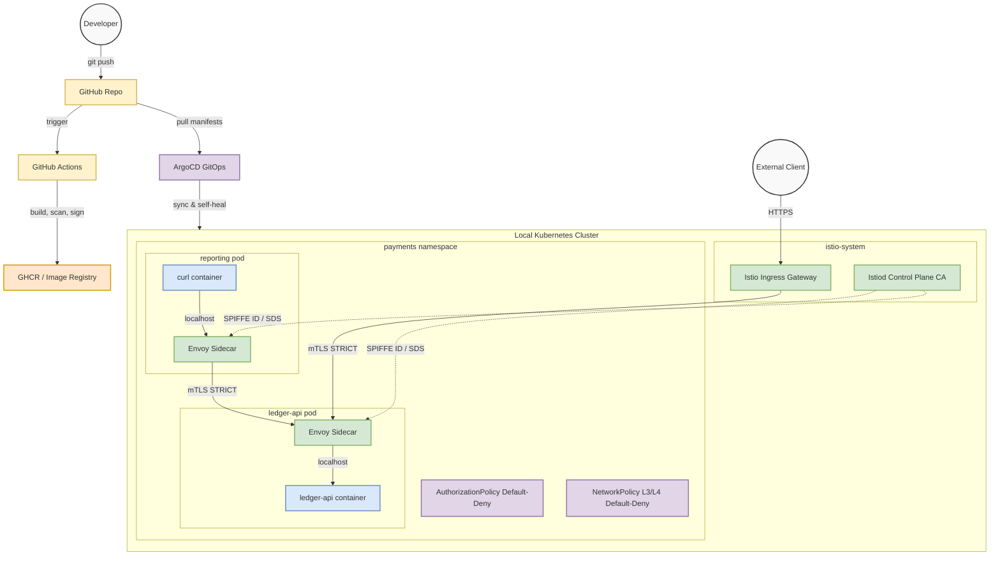

# Dodo Payments — Security & DevOps Engineer Technical Assessment

**Candidate:** Shaik Mohammad Wasim  
**Email:** thebatmanfrommars@gmail.com  
**Date:** July 2026  

---

## Overview

This repository contains the complete solution for the Dodo Payments Security & DevOps Engineer technical assessment. The assessment covers four tasks spanning workload hardening, secure CI/CD, zero-trust networking, and offensive security.

**Scenario:** A fast-moving team shipped `ledger-api` — a microservice handling cardholder-adjacent data — onto a shared cluster with plaintext secrets, a root container, and no network policy. It's in PCI DSS scope, and an audit is coming. The mission: harden it end to end, then put on the attacker hat.

### 🟢 Proof of Execution: Secure CI/CD Pipeline
The fully automated GitHub Actions pipeline has been successfully executed, passing all security gates (Gitleaks, Semgrep, Trivy) and signing the image via Cosign with SLSA provenance:
- **[View the latest successful GitHub Actions Pipeline Run](https://github.com/mohammadthekingslayer/dodo-payments-assessment/actions/runs/29809468345)**

---

## Architecture Diagram



---

## Repository Structure

```
dodo-payments-assessment/
├── README.md                          ← This file
├── .github/workflows/pipeline.yml     ← Live CI/CD pipeline
│
├── task1/                             ← Deploy & Harden the Workload
│   ├── README.md
│   ├── manifests/
│   │   ├── namespace.yaml             (PSS restricted enforcement)
│   │   ├── deployment.yaml            (hardened Deployment + Service)
│   │   ├── neighbour.yaml             (reporting service, fully hardened)
│   │   ├── serviceaccount.yaml        (dedicated least-privilege SA)
│   │   ├── rbac.yaml                  (Role + RoleBinding)
│   │   ├── rbac-personas.yaml         (dev/operator/admin roles)
│   │   ├── configmap.yaml             (non-sensitive configuration)
│   │   ├── sealed-secret.yaml         (encrypted secrets via Sealed Secrets)
│   │   ├── ingress.yaml               (TLS-enforcing ingress)
│   │   └── network-policy.yaml        (default-deny + explicit allows)
│   └── kyverno-policies/
│       └── policies.yaml              (deny root, deny :latest, verify signatures)
│
├── task2/                             ← Secure CI/CD Pipeline & Supply Chain
│   ├── README.md
│   ├── .github/workflows/
│   │   └── pipeline.yml               (reference: full build/scan/sign pipeline)
│   └── manifests/
│       └── argocd-app.yaml            (GitOps with selfHeal + drift detection)
│
├── task3/                             ← Service Mesh & Zero-Trust (Istio)
│   ├── README.md
│   └── istio/
│       ├── peer-auth.yaml             (mTLS STRICT enforcement)
│       ├── authz-policy.yaml          (default-deny + SPIFFE identity allows)
│       ├── network-policy.yaml        (L3/L4 default-deny + explicit allows)
│       ├── gateway.yaml               (Istio Ingress Gateway + TLS termination)
│       └── canary.yaml                (VirtualService + DestinationRule canary)
│
└── task4/                             ← Reconnaissance & Penetration Testing
    ├── README.md
    └── report.md                      (standalone pen test report)
```

---

## Task Summaries

### [Task 1 — Deploy & Harden the Workload](task1/README.md)
Transformed the insecure `ledger-api` into a production-grade deployment:
- Non-root, read-only filesystem, all capabilities dropped, seccomp RuntimeDefault
- Resource limits and health probes on every container
- Dedicated ServiceAccount with RBAC scoped to actual needs
- Secrets encrypted via Sealed Secrets (no plaintext in Git)
- Kyverno admission policies blocking root, `:latest`, and unsigned images
- **Bonus:** RBAC personas (dev/operator/admin), PSS restricted, admission rejection demo

### [Task 2 — Secure CI/CD Pipeline & Supply Chain](task2/README.md)
Built a GitHub Actions pipeline with security enforcement:
- Gitleaks (secrets), Semgrep (SAST), Trivy (CVE) scanning with explicit fail policies
- Cosign keyless image signing + SLSA provenance attestation
- SARIF upload to GitHub Security tab
- ArgoCD GitOps with `selfHeal: true` for drift detection and auto-revert
- **Bonus:** SARIF integration, cosign verify proof, canary rollout strategy

### [Task 3 — Service Mesh & Zero-Trust (Istio)](task3/README.md)
Implemented identity-based zero-trust networking:
- mTLS STRICT via PeerAuthentication
- Default-deny AuthorizationPolicy + explicit allows by SPIFFE workload identity
- Kubernetes NetworkPolicy as L3/L4 defense-in-depth layer
- Certificate lifecycle documentation (Istiod CA, SDS, auto-rotation)
- **Bonus:** Istio Ingress Gateway with TLS termination, canary VirtualService, PCI CDE scope mapping

### [Task 4 — Reconnaissance & Penetration Testing](task4/README.md)
Offensive security assessment:
- Passive OSINT of `dodopayments.tech` (DNS, CT logs, TLS, HTTP fingerprinting)
- 8 findings in `ledger-api`: 1 Critical (YAML RCE), 5 High, 2 Medium
- Full CVSS v3.1 scoring, curl PoCs, and remediation guidance
- **Bonus:** SSRF→RCE attack chain, defensive control mapping to Tasks 1–3, retest section

---

## Design Philosophy

1. **Defense in Depth** — Every control layer is independent. NetworkPolicy, Istio AuthzPolicy, Kyverno, and RBAC each catch different attack vectors.
2. **Shift Left** — Security scans run in CI before code reaches production. Gitleaks, Semgrep, and Trivy gate the pipeline.
3. **Zero Trust** — No implicit trust. mTLS for all inter-service communication, identity-based (not IP-based) authorization.
4. **Least Privilege** — Every service, SA, and persona gets the minimum permissions needed.
5. **Git as Source of Truth** — ArgoCD treats Git as the single source of truth. Manual changes are automatically reverted.
