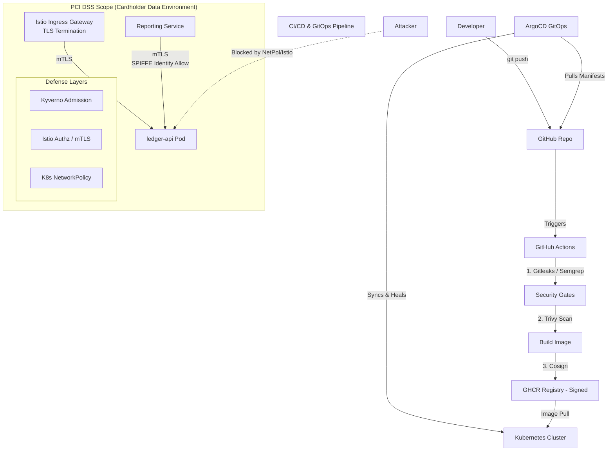

# Dodo Payments — Security & DevOps Engineer Technical Assessment Write-Up

**Candidate:** Shaik Mohammad Wasim  
**Role:** Security & DevOps Engineer

---

## 1. Initial Risk Assessment
Upon joining, I evaluated the `ledger-api` microservice. Because this service handles cardholder-adjacent data, it falls strictly within **PCI DSS scope**. The initial state of the deployment was highly insecure:
- The container ran as `root`, meaning a simple code execution vulnerability could lead to host node compromise.
- Plaintext secrets (`STRIPE_API_KEY`, `DB_PASSWORD`) were hardcoded in Git, risking immediate financial fraud and data breaches.
- The network lacked segmentation, allowing lateral movement across the cluster.

My primary objective was to transform this into a production-grade, zero-trust environment using a **Defense in Depth** strategy—ensuring that if one security layer fails, another is there to catch the attacker.

## Architecture Diagram

## 2. Workload Hardening (Defense Layer 1: The Pod)
Security must start as close to the application as possible. I locked down the `securityContext` to prevent privilege escalation:
- Forced non-root execution and dropped all Linux capabilities.
- Mounted a `readOnlyRootFilesystem` to prevent attackers from dropping malware or modifying binaries post-exploitation.
- Implemented **Bitnami Sealed Secrets** to safely store credentials in Git using asymmetric encryption. Only the cluster has the private key to decrypt them.
- Finally, I implemented **Kyverno admission policies** to act as a hard cluster guardrail. Even if a developer accidentally removes the security context, Kyverno will reject the deployment before it ever runs.

## 3. Secure Delivery & GitOps (Defense Layer 2: The Pipeline)
Good intentions don't scale; automation does. I restructured the CI/CD pipeline to fail *before* insecure code reaches the cluster:
- **Shift-Left Scanning:** Added `Gitleaks` (secrets), `Semgrep` (SAST), and `Trivy` (CVEs). I configured strict fail policies for Critical/High findings, with SARIF output sent directly to the GitHub Security tab for visibility.
- **Supply Chain Security:** I implemented **Cosign keyless signing** to generate SLSA provenance. The cluster is configured to reject any unsigned images.
- **GitOps:** I deployed **ArgoCD** as the single source of truth. With `selfHeal` enabled, any manual, out-of-band changes to the cluster (like an attacker altering an image tag via `kubectl`) are immediately detected and reverted back to the secure Git state.

## 4. Zero-Trust Mesh (Defense Layer 3: The Network)
To satisfy PCI DSS segmentation requirements, I deployed **Istio** to establish a strict Cardholder Data Environment (CDE) boundary:
- **Encryption in Transit:** Enforced `STRICT` mTLS across the namespace, completely disabling plaintext communication.
- **Identity over IP:** I implemented a default-deny `AuthorizationPolicy`. Instead of relying on spoofable IP addresses, access is explicitly granted based on **SPIFFE workload identity** (cryptographically tied to the Kubernetes ServiceAccount). 
- **Defense in Depth:** I layered a standard Kubernetes `NetworkPolicy` underneath Istio. If an attacker manages to bypass the Envoy sidecar proxy, they are still blocked at the L3/L4 kernel level by the CNI.
- **Gateway Evolution:** *Note on Task 1 vs Task 3:* The initial Nginx Ingress deployed in Task 1 is formally superseded by the Istio Ingress Gateway configured in Task 3. Once `STRICT` mTLS is enforced, the standard Nginx controller can no longer route plaintext traffic into the mesh, making the Istio Gateway the mandatory entrypoint.

## 5. Offensive Perspective (The Pentest)
Putting on the attacker hat revealed exactly why these controls are necessary. During the penetration test, I discovered a **Critical YAML Deserialization RCE** chained with a **High severity SSRF**. 

In the original insecure cluster, an attacker could use the SSRF to hit the internal Kubernetes API, use the YAML RCE to execute a reverse shell as root, read the plaintext Stripe API keys from the environment, and dump the unmasked PAN data.

**With our new controls in place:**
- The **read-only filesystem** stops the attacker from downloading exploit payloads.
- The **NetworkPolicy** blocks the SSRF from reaching internal AWS metadata or K8s APIs.
- The **AuthorizationPolicy** drops unauthorized traffic trying to reach the RCE endpoint.
- **Semgrep** catches the unsafe `yaml.load()` in the CI pipeline before it's even merged.

## Conclusion
By combining Kubernetes native controls, GitOps automation, and an identity-based service mesh, we have successfully migrated `ledger-api` from an insecure, non-compliant state to a highly resilient, PCI-ready architecture.
